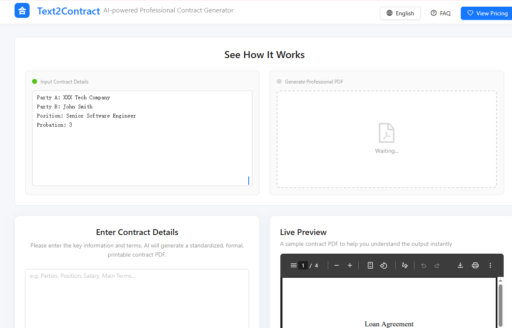
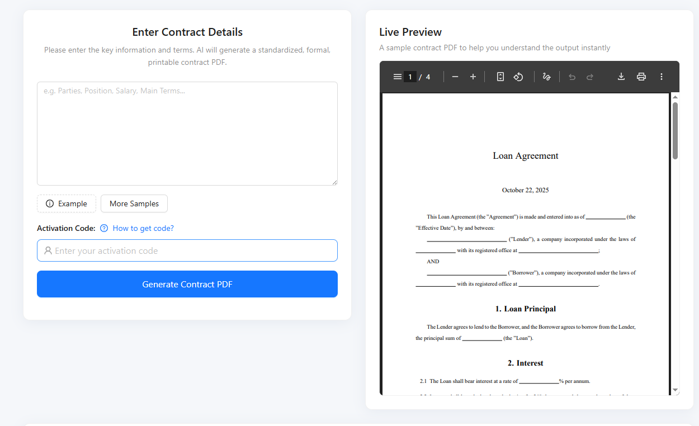

# Text(Contracts) to PDF(文本转合同版Text2Contract)
## (en)A tool that leverages large language model capabilities to directly generate documents in PDF format, suitable for contract layout and document formatting.
## (zh)一个用大模型能力直接输出PDF格式的工具，可以用于合同排版，文档排版

# Preview


# 界面展示


## Features
- Support for both English and Chinese languages
- AI-powered contract generation (with customizable elements)
- High-quality LaTeX contract formatting with one-click PDF download
- Modern and elegant UI optimized for mobile devices
- SEO optimization for better global reach
## 功能特色
- 支持中英文双语切换
- 智能AI合同内容生成（支持自定义要素）
- LaTeX高质量合同排版，PDF一键下载
- 现代化美观UI，移动端适配
- SEO优化，适合出海

## Stack
- Frontend：React + Ant Design + i18next
- Backend：FastAPI + OpenAI/DeepSeekAPI + XeLaTeX
## 技术栈
- 前端：React + Ant Design + i18next
- 后端：FastAPI + OpenAI/DeepSeekAPI + XeLaTeX

## start up
1. Install requirements
   ```bash
   cd frontend
   npm install
   ```
2. Start frontend
    ```bash
    npm run dev
    ```
3. Start backend
    ```bash
    cd backend
    uvicorn main:app --host 0.0.0. --port 8080
    ```


