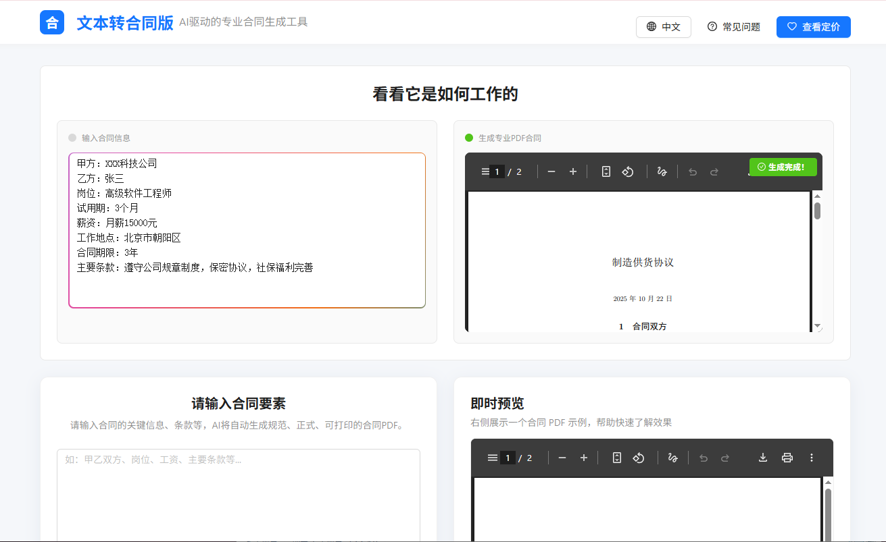

# Text(Contracts) to PDF
## (en)A tool that leverages large language model capabilities to directly generate documents in PDF format, suitable for contract layout and document formatting.
## (zh)一个用大模型能力直接输出PDF格式的工具，可以用于合同排版，文档排版
# 界面展示(Preview)

## 1.start frontend: npm run dev
## 2.start backend: uvicorn main:app --host 0.0.0.0 --port 8080

